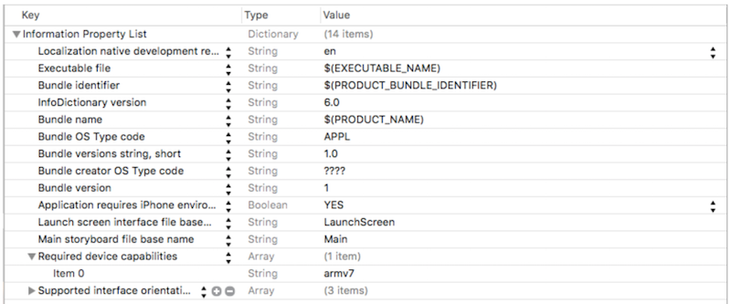

# 패스트캠퍼스 강의 노트 29th ( 20170619 )

# 오늘의 팁

## Slider & Switch & Activity Indicator

```swift
@IBAction func sliderMain(_ sender: UISlider) {
    
    labelSliderValue.text = String(sender.value)

}
    
@IBAction func switchMain(_ sender: UISwitch) {
    
    labelSwitchValue.text = String(sender.isOn)
    
    if sender.isOn {
        labelSwitchValue.textColor = UIColor.blue
        viewBackgroundTest.backgroundColor = UIColor.yellow
    }else {
        labelSwitchValue.textColor = UIColor.red
        viewBackgroundTest.backgroundColor = UIColor.blue
    }
    
}

@IBAction func buttonIndicatorOnOff(_ sender: UIButton) {
    
    if activityIndicatorMain.isAnimating {
        activityIndicatorMain.stopAnimating()
    }else {
        activityIndicatorMain.startAnimating()
    }
    
}
```

## Tint Color & Button
 - 스토리보드 최상단에서 `tint` 컬러를 주면, 앱의 핵심 컬러를 컨트롤할 수 있다.
	 - 애플의 캘린더 앱은 red로 tint 컬러를 주었고, 메모 앱은 yellow로 `tint` 컬러를 주었다.
 - 버튼의 속성으로 `Default`, `Higlighted`, `Selected`가 있다.


# Plist data

## Property List
 - 심플한 “파일” 저장 방법 중 하나.
 - Key,Value구조로 데이터 저장.
 - File 형태로 저장되다 보니 외부에서 Access가능(보안 취약) // iTunes에 연결해서 앱을 풀어보면, resources들은 모두 볼 수 있고, Plist도 그 중 일부이다.



## Plist 파일의 위치
> 번들은 읽기만 가능하고, 도큐멘트는 읽기/쓰기 모두 가능하다.
> 다만, 도큐멘트에는 Plist를 만들기 어려워서 번들에 파일을 만들고, 도큐멘트에 복붙한다.
> 만약, 앱에서 읽기만 하는 데이터라면 굳이 도큐멘트로 보낼 필요는 없다.

 - 파일이 저장되는 곳, `Bundle` & `Documents` 폴더.
 - 앱, **프로젝트에 추가된** 모든 Resources들은 `Bundle`에 저장된다.
 - 프로그램이 **실행되며** 저장하는 파일은 `Documents`에 저장된다.
 - 즉! Plist 파일의 **데이터만 불러오는 역할은 Bundle**을 통해서, Plist 파일에 **데이터를 쓰고 불러오는 역할은 Documents폴더** 에 저장된 파일로!


# Bundle
 - 실행코드, 이미지, 사운드, nib 파일, 프레임 워크,설정파일 등 코드와 리소스가 모여있는 `file system`내의 `Directory`

## Main Bundle 가져오기

```swift
// Get the main bundle for the app.
let mainBundle = Bundle.main // 싱글턴 패턴
```

## Bundle 파일 주소와 데이터 가져오기
 - `forResource`에 파일명, `ofType`에 타입명을 작성한다.
 - Type은 일종의 확장자 개념.
 - `mainBundle.path()`는 파일이 존재하지 않을 수 있기 때문에 옵셔널 값을 리턴한다.

```swift
// Get the main bundle for the app.
let mainBundle = Bundle.main
let filePath = mainBundle.path(forResource: "rName", ofType:
"rType")
```

### 데이터 가져오기

```swift
if let path = filePath {
     let image = UIImage(contentsOfFile: path)
}
```

## Plist File In Bundle
 - 파일로부터 Dictionary를 바로 가져올 수 없어서 Obj-C의 `NSDictionary`를 이용해 값을 가져와서 캐스팅하였다.
 - `NSDictionary`는 Obj-C에서 클래스이다.
 - `그.러.나` **Swift4** 에서부터 파일에서 Dictionary를 바로 가져올 수 있게 되었다.

```swift
if let filePath = mainBundle.path(forResource: "rName", ofType: "rType"),
   let dict = NSDictionary(contentsOfFile: filePath) as? [String: AnyObject]
{
	// use swift dictionary as norma
}
```

## Plist 쓰기

1. `Document folder Path 찾기.`
2. `Document folder에 Plist 파일이 있는지 확인.`
3. `만약 없다면 : bundle에 있는 파일을 Document에 복사 Path를 통해 객체로 변환, 데이터 불러오기.`
4. `writeToFile 메소드로 파일 저장.`


### 1. Document folder Path 찾기.
 - `NSSearchPathForDirectoriesInDomains`
 - 파일 불러오기.
 - `SearchPath`를 기억하자.
 - `doucument` 폴더의 `Path` 구하기

```swift
let path:[String] =
NSSearchPathForDirectoriesInDomains(.documentDirectory, .userDomainMask,
true)
let basePath = path[0] + "/fileName.plist"
```

### 2. Document folder에 Plist 파일이 있는지 확인.
- `doucument` 폴더에 `Plist` 파일이 존재하는지 확인.

```swift
if !FileManager.default.fileExists(atPath: basePath) {
	// Document folder에 Plist 파일이 없다면, 여기 라인을 실행.
}
```

### 3. (만약 없다면) bundle에 있는 파일을 Document에 복사
- 만약 `doucument`에 해당 `Plist` 파일이 존재 하지 않을때, `bundle`에 있는 파일을 `document` 폴더로 복사.
- **번들 파일은 읽기만 가능하기 때문에 도큐먼트 파일로 복사한다!!!**

```swift
if let fileUrl = Bundle.main.path(forResource: "fileName", ofType: "plist") {
    do {
         try FileManager.default.copyItem(atPath: fileUrl, toPath: basePath)
    } catch {
         print("fail")
	 }
}
```

### 4. Dictionary 인스턴스 불러오기 & 파일 저장
 - `document` 폴더에 있는 파일을 `NSDictionary`을 통해서 `Dictionary` 인스턴스로 불러오기.
 - `write(toFile)` 메소드를 통해 파일 저장.
 - `dictionary`를 수정.
 - `NSDictionary`로 변경 후 `write(tofile)` 메소드를 통해 파일에 저장.

```swift
if let dict = NSDictionary(contentsOfFile: basePath) as? [String: Any]
{
	var loadData = dict
	loadData.updateValue("addData", forKey: "key")
	
	let nsDic:NSDictionary =  NSDictionary(dictionary: loadData)
	nsDic.write(toFile: basePath, atomically: true)
}
```

---
### 문서 끝 ( by 재성 )