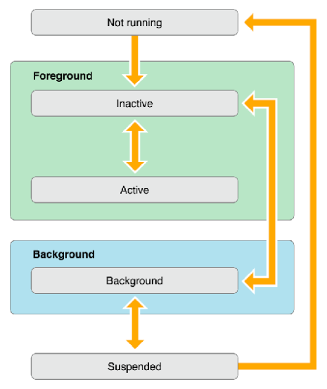
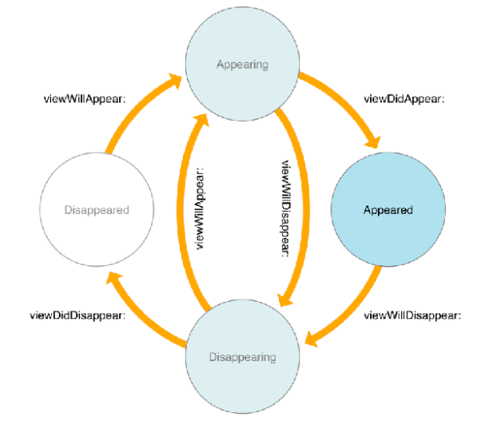

# 패스트캠퍼스 강의 노트 12th ( 20170523 )

# 오늘의 팁
 - `self.`는 같은 변수 이름인데, 클래스에도 있고, 함수에도 있을 때, **명시적으로 표현하고자 할 때** 사용한다.
 - 같은 이름의 변수가 2개 있을 때, `self.`를 하면, 클래스에 있는 변수를 불러낸다.

# Application Life Cycle

## The Main Run Loop
 - 터치를 하면, OS가 받고, Event로 받고, 내 앱이 받는다.
 - `Model(Data) - Controller(App Delegate) - View(UIWindow)` 이 3가지가 유기적으로 상호작용하며, 앱이 작동된다.

### 이벤트 처리
 - `Touch` : 발생된 이벤트에 대한 뷰가 처리.
 - `Remote control` & `Shake motion events` : First responder 객체.
 - `Accelerometer` / `Magnetometer` / `Gyroscope` : 각각의 객체로 전달.
 - `Location` : CoreLocation 객체.
 - `Redraw` : 업데이트를 원하는 뷰가 처리.

## Application Delegate

### Execution States for Apps

 - `Not running` > `Foreground[Inactive]` < - > `Foreground[Active]` > `Background[Background]` > `Suspended`
 - `Active` > `Inactive` < - > `Background`
 - 앱을 실행시키다가 홈 버튼을 눌렀을 때, 앱이 `Background`로 가서 꺼지는 것이 아니고, `Inactive` 상태로 두고, `Background`에 누적시키는 것이며, 앱이 해야할 일을 `Background`에게 위임해준다.




### Call to the mothods of your app delegate object

1. 대부분의 상태 변화를 App Delegate 객체에 호출되는 메소드를 오버라이드하여 알아챌 수 있다.
2. 싱글뷰 프로젝트 생성 후, `AppDelegate.swift` 파일에서 아래 내용을 확인할 수 있다.
3. 앱이 `Active` 상태일 때와 홈 버튼을 눌러 빠져 나왔을 때 등의 액션을 정의한다.

- `application:willFinishLaunchingWithOptions:`
	- 어플리케이션이 **최초 실행될 때** 호출되는 메소드.
- `application:didFinishLaunchingWithOptions:`
	- 어플리케이션이 **실행된 직후** 사용자의 화면에 보여지기 직전에 호출.
- `applicationDidBecomeActive:`
	- 어플리케이션이 **Active** 상태로 **전환된 직후** 호출.
- `applicationWillResignActive:`
	- 어플리케이션이 **Inactive** 상태로 **전환되기 직전** 호출.
- `applicationDidEnterBackground:`
	- 어플리케이션이 **Background** 상태로 **전환된 직후** 호출.
- `applicationWillEnterForeground:`
	- 어플리케이션이 **Active** 상태가 되기 **직전에**, **화면에 보여지기 직전의** 시점에 호출.
- `applicationWillTerminate:`
	- 어플리케이션이 **종료되기 직전에** 호출.

## Supported Background Tasks
```
• Audio and AirPlay (음악)
• Location updates (위치 정보)
• Voice over IP (인터넷을 사용한 음성통화)
• Newsstand downloads(뉴스 스탠드 다운로드)
• External accessory communication (기타 하드웨어 액세사리)
• Bluetooth LE accessories (블루투스 액세사리 사용)
• Background fetch (네트워크를 통한 일반적인 다운로드나 미완료된 작업)
• Remote notifications (PushNotification)
```

## UIVIewController
 - `[ viewLoad ]` > `viewDidLoad` > `viewWillAppear` > `[ Appearing ]` > `viewDidAppear`
 - 오버라이드 하는 메소드이므로 꼭 해당 메소드 내에서 `super.`을 통해 부모의 메소드를 꼭 호출해야 된다. ( 아래 소스 참고 )

```swift
override func viewDidAppear(_ animated: Bool){
	super.viewDidAppear(animated)
}
```

 - 아래와 같은 뷰의 흐름을 이해하고 있어야만 한다.
	 - 햄버거 메뉴(a.k.a 슬라이딩 메뉴) 같은 것들을 만들고, 애니메이션을 넣을 때 `viewDidAppear`를 사용해야 하고, 애니메이션을 적절히 처리할 수 있다.
	 - 또 다른 예로 뷰를 없애는 애니메이션을 보여주면서 영상을 끄려는데, `viewDidDisappear`를 사용해야 원하는대로 처리할 수 있다.
 - 스토리보드에서 뷰 컨트롤러를 클릭하고, `Is INitial View Controller`로 시작하는 뷰 컨트롤러를 지정한다.



### 생명주기 메소드
// `will`: 할거니까 **준비**

// `did` : 이미 했으니까 **결과**

 - `override func loadView()`
	 - UIViewController의 view가 생성될 때 호출
 - `override func viewDidLoad()`
	 - UIViewController가 인스턴스화 된 직후(메모리에 객체가 올라간 직후) 호출.
	 - 처음 한 번 세팅해 줘야하는 값들을 넣기에 적절.
 - `override func viewWillAppear(_ animated: Bool)`
	 - view가 화면에 **보여지기 직전에** 호출. 화면이 보여지기 전에 준비할 때 사용.
	 - `animated` 파라미터는 뷰가 애니메이션을 동반하여 보여지게 되는지 시스템에서 전달해주는 불리언 값.
 - `override func viewWillLayoutSubviews()`
	 - view의 하위뷰들의 레이아웃이 **결정되기 직전** 호출.
 - `override func viewDidLayoutSubviews()`
	 - view의 하위뷰들의 레이아웃이 **결정된 후** 호출.
	 - 주로 view의 하위뷰들의 사이즈 조정이 필요할 때 호출.
 - `override func viewDidAppear(_ animated: Bool)`
	 - view가 화면에 **보여진 직후에** 호출.
	 - 화면이 표시된 이후 애니메이션 등을 보여주고 싶을 때 유용.
 - `override func viewWillAppear(_ animated: Bool)`
	 - view가 화면에서 **사라지기 직전에** 호출.
 - `override func viewDidDisappear(_ animated: Bool)`
	 - view가 화면에서 **사라진 직후에** 호출.

# 접근 제어

## 접근 제한
 - `모듈` : 배포할 코드의 묶음 단위, 통상 프레임워크나 라이브러리, 애플리케이션이 모듈의 단위가 될 수 있다.
 - `소스 파일` : 하나의 스위프트 소스코드 파일.

## 접근 제어 키워드
// `외부 접근 Vs 인터널 Vs 내부 접근` 이렇게 나눠서 이해할 수 있다.

1. `Open` (개방 접근수준) : 모듈 외부까지 접근 가능
2. `public` (공개 접근수준) : 모듈 외부까지 접근 가능
3. `internal` (내부 접근수준) : 모듈 내부에서 접근 가능, 기본 지정값 ( 별도 지정하지 않으면, internal이 default 값 )
4. `fileprivate` (파일외 비공개) : 파일 내부에서만 접근 가능
5. `private` (비공개) : 기능 정의 내부에서만 가능

- `Open`과 `Public`의 차이는 **상속을 받을 수 있는가**의 차이이다. ( `Open`이 상속을 받을 수 있다. )


---
### 문서 끝 ( by 재성 )